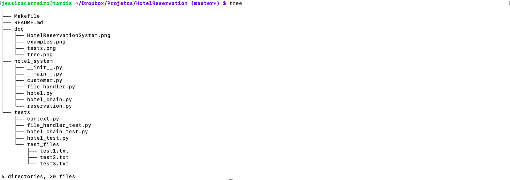
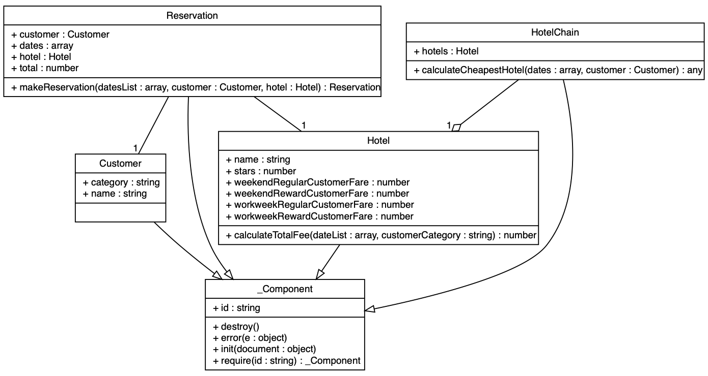
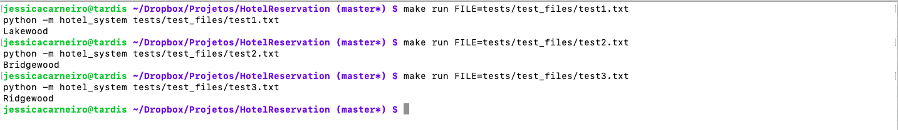
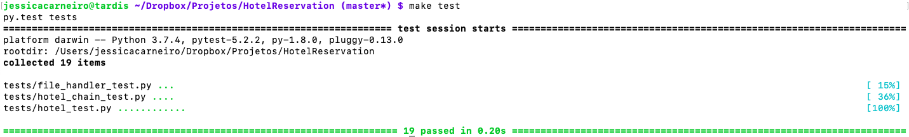

# Hotel Reservation System

This application allows a customer or hotel employee to calculate the cheapest hotel to stay
during specified dates.

## Folders structure

The application is divided in three folders:

- `doc`: containing images that compose this documentation
- `hotel_system`: main folder with the application files
  - `__init__.py`: package directory definition
  - `__main__.py`: contains the `main()` function that will solve the problem
  - `customer.py`: class that represents a `Customer`
  - `file_handler.py`: file with auxiliary methods to handle the input files
  - `hotel_chain.py`: class that represents a `HotelChain`
  - `hotel.py`: class that represents a `Hotel`
  - `reservation.py`: class that represents a `Reservation`
- `tests`: folder with the tests written and some test files

## Solution design

The solution was designed considering OO programming principles. There are four classes in the design:

- `Hotel`: represents a hotel in the system
- `Customer`: represents a customer in the system
- `Reservation`: represents a reservation that a customer could make for a specific hotel
- `HotelChain`: represents a chain of multiple hotels

The picture above shows the class diagram with all attributes and methods for each class:

## How to run

To run the application with a specific file:

`make run FILE=/path/to/file/`

To run all the tests:

`make test`

To clean the executables:

`make clean`

## Examples

The figure above shows some test examples running with this solution. These test files are in
the path `tests/test_files`

## Tests

There are 19 automatized tests written for this application. To run them use the command `make test`

